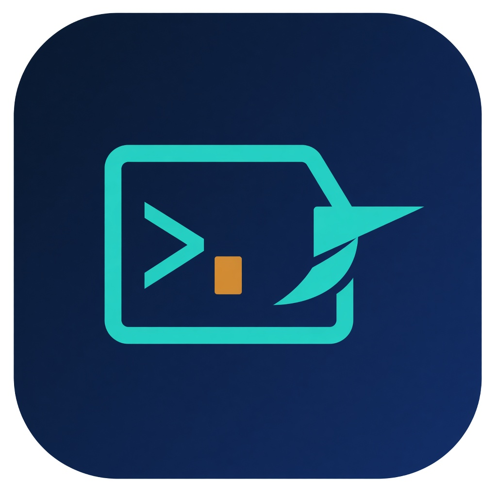

# TermPilot

人用的 SSH 终端，Agent 也能操作同一套连接。



## 能做什么

- 正向 SSH：密码或私钥。口令只在本机用系统安全存储加密，不经过 SSH Agent。
- 反向监听：只监听 `127.0.0.1`。需要公网时，用 cpolar 这类工具把端口暴露出去。
- 本机终端，和远程会话一样放在标签里。
- 连接按机器（IP 或域名）分组。同一台机器下可以有多条连接。
- 远程文件树。文件夹和文件按类型显示图标。双击文本文件用编辑器打开，`Ctrl+S` 写回服务器。
- 终端截图，以及把滚动内容接成长图。截完可以选择打开目录或复制图片。
- 内置 MCP，默认地址 `http://127.0.0.1:3927/mcp`。设置里可以写入 Claude Code、Kimi Code、Codex、WorkBuddy。

## 开发

```bash
npm install
npm run dev
```

```bash
npm run typecheck
npm run build
```

会话保存在 `%APPDATA%\TermPilot\termpilot.db`。

## 许可

MIT
